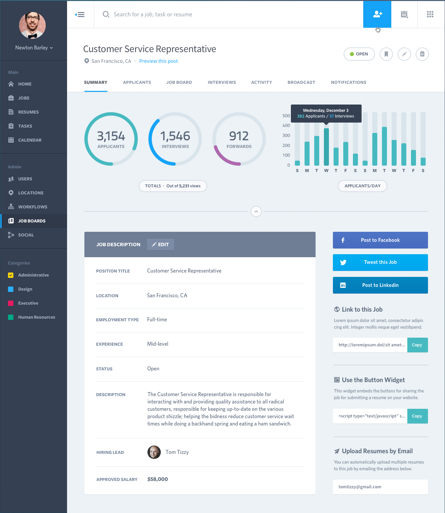
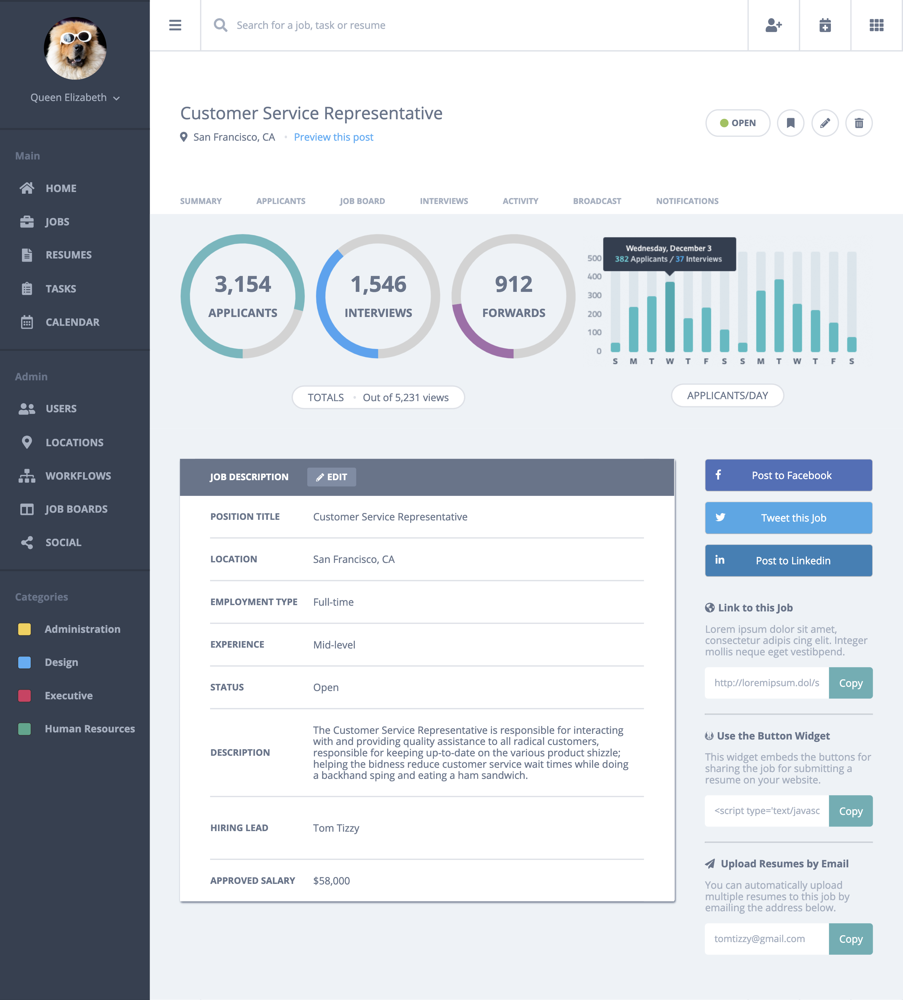

# Comp 2 Challenge

This is the fourth project I completed during the front end program at the [Turing School of Software and Design](https://https://turing.io/). The point of the project was to recreate a 1-page site to practice writing well structured, semantic HTML with clean, precise CSS.

You can visit the live finished version of this project at https://ryandbarnett.github.io/rb-comp-challenge-2/.

## Key Features

* **Chart.js** - Uses Chart.js library to create circle graphs
* **Flexbox** - Uses flexbox to make layout fluid
* **Grid** - Uses css grid

## Built With

* [HTML](https://developer.mozilla.org/en-US/docs/Web/Guide/HTML/HTML5)
* [CSS](https://developer.mozilla.org/en-US/docs/Web/CSS)

## Authors

* **Ryan Barnett** - [Ryan's Github](http://github.com/RyanDBarnett)

## What The Site Should Look Like

## Finished Project

## License

This project is licensed under the MIT License - see the [LICENSE.md](LICENSE.md) file for details
